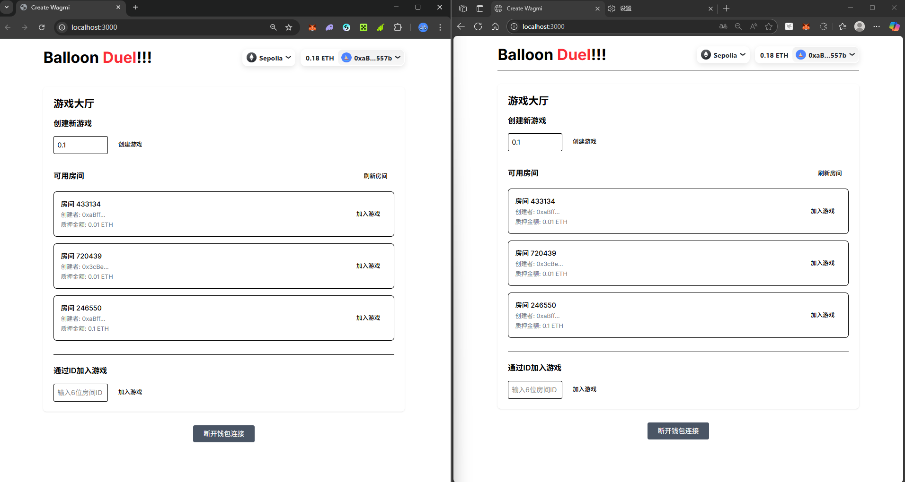
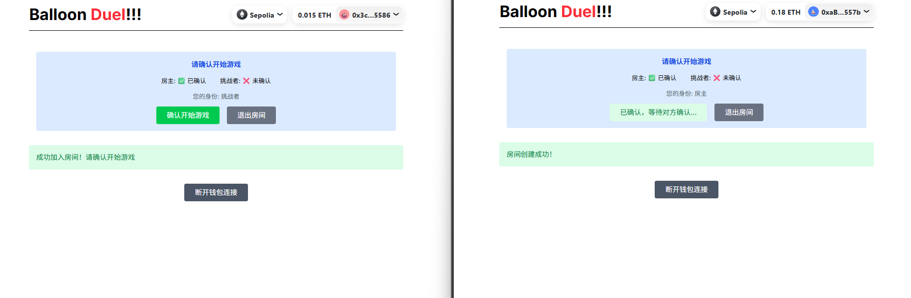
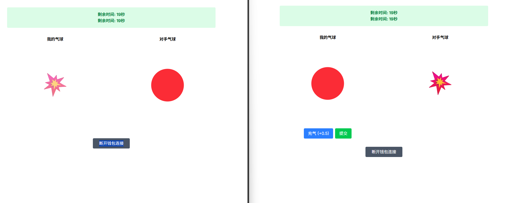
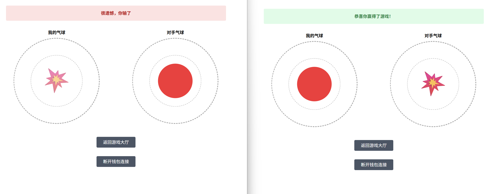

# Web3 Balloon Game 🎈

## 游戏截图

  
  

  
  

智能合约部分代码未完成

Web3 Balloon Game 是一个基于区块链的在线对战游戏。玩家通过调整气球大小来竞争，最接近目标值的玩家获胜。游戏集成了智能合约和链上随机数，为玩家提供公平、透明的游戏体验。

## ✨ 特性

- 🎮 趣味性的气球打气对战玩法
- 💰 代币质押机制，增加游戏趣味性
- 🔗 基于区块链的公平随机数生成
- 🌐 支持多链部署 (Ethereum Sepolia, Polkadot Westend)
- 👥 实时对战系统
- 📱 响应式设计，支持移动端

## 🛠 技术栈

- **前端框架：** Next.js, React, TailwindCSS
- **区块链：** Solidity, Hardhat, ethers.js
- **后端服务：** DynamoDB
- **预言机：** Chainlink VRF
- **钱包连接：** wagmi, viem

## 🚀 快速开始

### 环境要求

- Node.js 16+
- pnpm 8+
- AWS 账号（用于 DynamoDB）
- MetaMask 钱包

### 本地部署步骤

1. 克隆项目并安装依赖：
\`\`\`bash
git clone https://github.com/yourusername/web3-balloon.git
cd web3-balloon
pnpm install
\`\`\`

2. 配置环境变量：
\`\`\`bash
cp .env.example .env.local
\`\`\`
编辑 .env.local 文件，填入必要的配置项：
\`\`\`
NEXT_PUBLIC_ALCHEMY_API_KEY=your_alchemy_key
NEXT_PUBLIC_WALLET_CONNECT_PROJECT_ID=your_project_id
AWS_ACCESS_KEY_ID=your_aws_key
AWS_SECRET_ACCESS_KEY=your_aws_secret
\`\`\`

3. 设置 DynamoDB：
\`\`\`bash
pnpm run setup-db
\`\`\`

4. 启动开发服务器：
\`\`\`bash
pnpm run dev
\`\`\`

现在您可以访问 http://localhost:3000 开始游戏了！

### 智能合约部署

1. 编译合约：
\`\`\`bash
pnpm hardhat compile
\`\`\`

2. 部署到测试网：
\`\`\`bash
pnpm hardhat deploy --network sepolia
\`\`\`

## 🎮 游戏规则

1. 创建/加入游戏房间
2. 双方各自质押相同数量的代币
3. 游戏开始后，有20秒时间调整气球大小
4. 通过点击按钮增加气球大小（每次+0.5）
5. 在认为合适时点击确认按钮
6. 游戏结束时，最接近目标值的玩家获胜
7. 获胜者获得所有质押的代币

## 📄 许可证

本项目采用 MIT 许可证，详见 [LICENSE](LICENSE) 文件。
